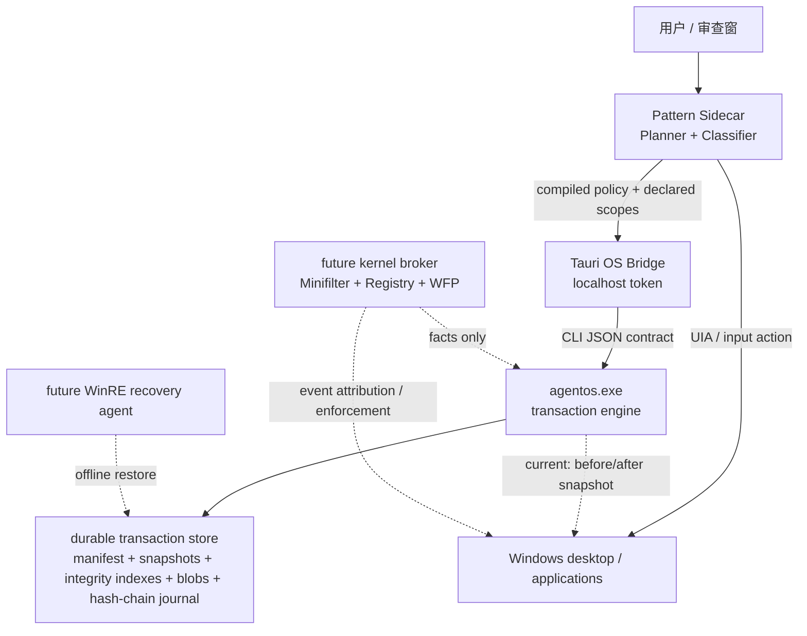
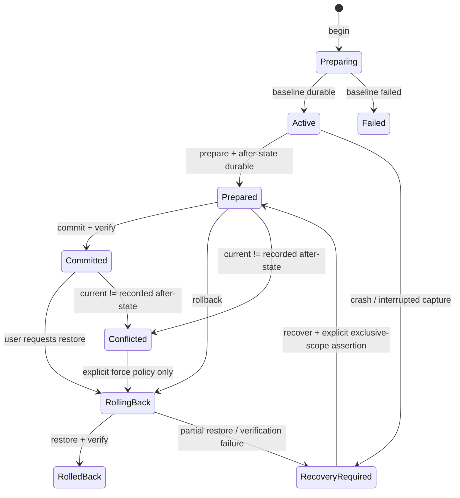

# AgentOS Windows Sandbox & Recovery Architecture

> 状态：用户态恢复层已集成，内核安全边界尚未实现  
> 更新：2026-07-16  
> Core 代码：sibling `../../Core`；产品集成：本仓库

## 1. 目标与边界

AgentOS 让 Pattern 在真实 Windows 桌面执行任务时具备可审计、可冲突检测、可恢复的事务边界。Agent App 负责推理、风险分类和 scope 声明；Runtime 只处理已经编译好的策略与系统事实，不调用模型，也不解释用户意图。

当前可交付能力是**声明 scope 的用户态前后快照与条件式恢复**，不是全系统捕获，更不是防御本机管理员或内核攻击者的安全边界。它能可靠保护已声明的普通文件、注册表、服务和计划任务；不能承诺恢复 scope 外副作用、网络外发、锁定系统文件或驱动安装。

必须区分三个概念：

| 能力 | 当前状态 | 含义 |
|------|----------|------|
| Policy / approval | 已实现 | T0-T3、工作区边界、人工审批与硬拒绝 |
| Transaction recovery | 已实现（用户态、声明 scope） | baseline、after-state、三方冲突检测、commit 后保留恢复数据 |
| Containment / complete attribution | 未实现 | 需要受限 token/AppContainer/Sandboxie、Minifilter、Registry callback、WFP 和进程归因 |

## 2. 进程与信任模型



当前假设：

- 模型输出、网页内容、附件、插件和被操作应用均不可信。
- Tauri Bridge token 只授予本机 Sidecar；Bridge 不应暴露到局域网。
- transaction store 需要仅当前用户和受信 broker 可写。当前已使用本地目录，但专用服务账户与强化 ACL 尚未完成。
- 本机管理员、内核代码和能替换已签名二进制的攻击者不在当前防护模型内。
- detached transaction 无法从进程树自动归因；调用方必须在 `prepare` / `rollback` 前停止相关执行。

## 3. 事务协议与状态机

Pattern 每个 Computer Use 任务最多关联一个 detached transaction。第一个可变更动作前必须完成 baseline；只读观察不会创建事务。



关键语义：

1. `begin` 只有在 baseline、manifest 和 journal 已持久化后才返回 `Active`。
2. `prepare` 在任务停止写入后捕获 after-state；它不是 commit 的别名。
3. `commit` 表示接受当前结果，但默认保留恢复数据，直到 GC 安全清理。
4. `rollback` 先比较 baseline、transaction after-state 与 current state。current 被第三方修改时进入 `Conflicted`，默认不覆盖。
5. `recover --assume-exclusive` 仅处理崩溃时未形成 after-state 的事务。Pattern 必须让用户明确确认 scope 此后没有其它写入；未确认时 Sidecar 拒绝调用。
6. 当前 store 只允许一个正在 `Preparing` / `Active` / `RollingBack` 的修改事务，避免无法证明归属的并发写入。Pattern 也使用单一 FIFO 串行执行 Computer Use，审批中的任务会阻塞后续桌面动作。

## 4. 当前资源覆盖

| 资源 | 捕获与恢复 | 已知缺口 |
|------|------------|----------|
| 普通文件/目录 | 内容 SHA-256、before blob、创建/删除/修改、时间戳、DOS attributes、可用 security descriptor | 拒绝 reparse point；未完整建模 hardlink、ADS、稀疏文件、EFS、压缩属性、对象 ID、锁定文件 |
| 注册表 | 显式 hive scope 内 key/value、常见 value type、DACL、继承保护位、规范化 ACL fingerprint | 无 kernel callback；scope 外写入不可见；锁定 hive 不能离线恢复 |
| Windows 服务 | 显式服务的存在性、运行状态、`sc qc` 配置指纹；新建服务可删除 | 完整配置恢复依赖同时声明服务注册表 scope；依赖关系、failure actions、trigger 等仍需结构化 API |
| 计划任务 | 显式任务 XML、创建/删除/变更、XML 重建 | 未做 COM 层语义规范化；运行中的任务与凭据需专项处理 |
| 进程 | `run` 模式使用 kill-on-close Job Object 追踪子进程生命周期 | detached 模式由 Pattern 管理；无 kernel process attribution；逃逸/共享服务归因未解决 |
| VSS | elevated `full` 模式为声明卷记录持久 VSS baseline | Pattern 当前使用 `critical`；VSS 不是 WinRE，不能解决全部锁定对象与 registry hive 一致性 |
| Sandbox | `run --mode sandbox` 可调用已安装 Sandboxie | detached Pattern 任务不支持 sandbox mode；尚无受限 token/AppContainer 默认执行器 |
| 网络/驱动/系统配置 | 无 | 需要 WFP、驱动安装策略、专用 providers 和离线恢复 |

因此，任务页的“已连接”表示 Runtime 可用，不表示该任务所有副作用都已覆盖。Windows 上只要任务声明了 workspace，默认策略就要求 AgentOS 和该目录同时可用；否则可变更动作在进入 OS Bridge 前 fail closed。用户可在安全设置中显式关闭该策略。完全没有 workspace 的通用桌面操作仍显示 recovery `unavailable`，并由 T0-T3 Policy/审批约束。

## 5. 持久化与保留

Pattern 默认 store：`%LOCALAPPDATA%\pattern\recovery\`。

```text
recovery/
├─ .writer.lock
└─ <transaction-id>/
   ├─ manifest.json
   ├─ baseline-files.json
   ├─ after-files.json
   ├─ baseline-registry.json
   ├─ after-registry.json
   ├─ baseline-services.json
   ├─ after-services.json
   ├─ baseline-scheduled-tasks.json
   ├─ after-scheduled-tasks.json
   ├─ baseline-integrity.json
   ├─ after-integrity.json
   ├─ blobs/<sha256>
   └─ journal.ndjson
```

Durability 规则：

- manifest 使用同目录临时文件 + atomic replace；状态只在相应数据落盘后推进。
- baseline / after 的四类 snapshot 各自写入 SHA-256 索引，索引 hash 再锚定到 journal；commit、rollback、verify 前同时检查 manifest 声明、snapshot 结构、scope 一致性、索引和 journal。
- journal 由 sequence、previous hash 与 current hash 组成；验证失败时不得自动恢复或清理。hash chain 和索引没有密钥，只用于损坏与普通单文件篡改检测，不能抵抗能整体重写 store 的同权限攻击者。
- blob 在单事务内按 SHA-256 去重；已存在 blob 必须重新校验，恢复前所有必需 blob/VSS source 会先复制到临时 staging 并全量校验，全部成功后才开始 registry/file 写入。跨事务全局 chunk store 尚未实现。
- 损坏 manifest 的目录保留用于取证，不被 `list` 或 GC 静默删除。
- GC 只删除 `Committed` / `RolledBack`，同时受最大事务数、最大年龄和字节预算约束；活动、冲突和待恢复事务一律保留。
- Pattern 成功 commit 后运行保守 GC：最近 20 个、7 天、总计 5 GiB 的组合约束。

## 6. Pattern 集成契约

Bridge API：

| Endpoint | 用途 |
|----------|------|
| `GET /recovery/capabilities` | runtime、平台、store 可用性 |
| `POST /recovery/begin` | 创建 detached baseline，传 task id、mode 与 scopes |
| `POST /recovery/prepare` | 停止写入后封存 after-state |
| `POST /recovery/commit` | 接受结果并保留可恢复数据 |
| `POST /recovery/rollback` | 对 prepared/committed 事务做条件式恢复 |
| `POST /recovery/recover` | 处理中断事务；Sidecar 必须先取得 exclusive-scope 确认 |
| `POST /recovery/status` / `list` | 单事务或全 store 状态 |
| `POST /recovery/gc` | 安全保留策略 |

任务生命周期：

```text
first mutating action -> begin
task success          -> prepare -> commit -> gc
task failure/cancel   -> prepare -> rollback
Pattern restart       -> list -> select latest detached:<task-id> -> rebuild stable/recovery-required state
manual restore        -> rollback; interrupted transaction requires explicit exclusive confirmation
```

Bridge 已接受 file、registry、service 与 scheduled-task scopes；当前 Sidecar 自动事务只发送任务 workspace（或安全策略 workspace root）这一项现存 file scope。其它三类 scope 需要后续由结构化工具调用或 policy compiler 显式声明，不能从自然语言或进程结果猜测。

启动协调在成功读取 store 后只运行一次；后续 `runtime.configure` 刷新模型或通道配置不会重新解释正在执行的事务。持久化的 queued 任务会重新进入 FIFO；没有 transaction 证据的 running/awaiting task 会被标记为中断；同一周期任务有多个历史 transaction 时只使用 `createdAt` 最新的一条。

Runtime 查找顺序：`PATTERN_AGENTOS_EXE` → `<app>/resources/agentos.exe` → sibling Core development artifact。Windows 发布脚本重新 publish、自测、记录 SHA-256，再复制到 Tauri resources。当前 artifact 尚未 Authenticode 签名，发布报告必须保留 `NotSigned`，不能把 hash 校验当成代码签名。

## 7. 故障处理原则

| 故障 | 行为 |
|------|------|
| baseline 失败 | 不执行受保护动作；事务 `Failed` |
| Pattern 在 Active 时退出 | 下次启动标记任务失败和 `RecoveryRequired`，不自动猜测 after-state |
| prepare 失败 | 保留 store，任务失败；不宣称可安全 rollback |
| rollback 前发现第三方写入 | `Conflicted`，不覆盖；UI 展示差异 |
| restore 部分失败/验证不一致 | `RecoveryRequired`，保留全部证据 |
| journal、索引、snapshot、blob 或 manifest 损坏 | 首次恢复写入前 fail closed 并进入 `RecoveryRequired`；隔离目录供人工/离线处理 |
| store 超预算 | 只 GC terminal history，永不清理 active/conflicted/recovery-required |
| agentos 不可用 | 明确显示 `unavailable`；不能把 journal 当作恢复能力 |

## 8. 分阶段实现路线

### Phase A：用户态恢复强化（当前主线）

- 完成文件语义：hardlink group、ADS、sparse/compression/EFS 检测、case-only rename、跨卷 move。
- 服务改用 SCM API 结构化捕获；任务改用 Task Scheduler COM，避免本地化文本比较。
- transaction store 加强 ACL、静态加密选择、跨事务 chunk dedup、校验 scrub 与恢复演练。
- 使用受保护 broker 密钥为 evidence root 做 HMAC/签名，防止同权限进程同时改写 snapshot、索引和 journal；当前无密钥 hash 不承担此安全承诺。
- AgentOS broker 独立为 Windows service；Pattern 使用低权限 IPC，运行时校验调用者 SID、scope 与 policy schema。
- 扩展现有 workspace fail-closed 策略到结构化 registry/service/task scopes；对 UI 外部副作用明确提示覆盖不足。
- 签名 `agentos.exe`，打包时验证 publisher、版本、hash 与 schema compatibility。

### Phase B：内核事实捕获与限制

- File System Minifilter：pre/post create、write、set-information、rename、delete、security change；为 before-image 建立 copy-on-write 队列。
- Registry callback：key/value/security operations；使用 altitude、object context 与稳定 key identity。
- Process callbacks：PID + creation time + parent lineage + token/SID；把 transaction context 继承给子进程，处理共享 broker 的显式 delegation。
- WFP callout：按 transaction policy 记录/阻断 connect、listen 与 DNS 相关流量；默认不能“回滚”已外发数据，只能预防。
- 驱动只接收已签名、版本化的 policy blob，只上报事实；任何 LLM 文本不得进入内核接口。
- 明确定义 fail-open/fail-closed：普通桌面观察可 fail-open；声明为 protected 的写操作在 broker/driver 不健康时 fail-closed。

### Phase C：WinRE 离线恢复

- 在线 Runtime 生成带 hash、依赖顺序和预期基线的 recovery plan。
- WinRE agent 验证签名与 journal 后恢复锁定文件、registry hive、服务启动项，再做离线 verify。
- boot marker 防止恢复循环；失败时保留原对象与诊断包，不做不可逆清理。
- 覆盖 BitLocker、Secure Boot、系统更新 servicing stack 与多卷一致性测试。

### Phase D：产品化发布

- EV/attestation driver signing、HLK/WDK 兼容矩阵、安装/升级/回退和驱动自保护。
- Windows 10/11 各受支持 build、NTFS/ReFS、BitLocker、企业 EDR 共存与性能基线。
- chaos tests：进程 kill、断电模拟、磁盘满、ACL 拒绝、journal 损坏、并发第三方写入、WinRE 中断。
- 恢复 SLO：baseline 延迟、每 GiB 写放大、rollback 时间、存储增长、冲突率和不可恢复率。

## 9. 开源复用决策

以下仓库于 2026-07-16 通过 GitHub repository/license metadata 与仓库许可证核对：

| 项目 | 许可证 | 采用方式 |
|------|--------|----------|
| [Sandboxie Plus](https://github.com/sandboxie-plus/Sandboxie) | GPL-3.0 | 可作为可选 Mode 0 隔离执行器；若分发或修改，必须单独完成 GPL 合规与组件边界审查 |
| [Microsoft Windows Driver Samples](https://github.com/microsoft/Windows-driver-samples) | MS-PL | 以 `minispy`、`regfltr`、`WFPSampler` 为 WDK 起点；样例不是生产驱动，必须重做协议、错误处理、性能与签名 |
| [restic](https://github.com/restic/restic) | BSD-2-Clause | 借鉴 content-addressed pack、完整性校验与保留策略；不直接替代 transaction engine |
| [Kopia](https://github.com/kopia/kopia) | Apache-2.0 | 评估 chunking、压缩、去重、加密与 maintenance；可作为未来 blob backend 的独立进程候选 |
| [OpenEDR](https://github.com/ComodoSecurity/openedr) | Comodo Available Source License，非 OSI 开源 | 仅作架构研究，不复制、不链接、不作为可分发依赖；许可证含收费与分发限制 |

VSS、Job Object、Registry callback、WFP、SCM、Task Scheduler 和 WinRE 仍应优先使用 Microsoft 平台 API。开源项目提供实现参考或可替换组件，但不能代替 Windows 驱动签名、兼容性和恢复一致性验证。

## 10. 发布门槛

用户态 Recovery 可称为 beta 前至少满足：

- Core Release build 0 warning / 0 error，self-test 全绿；负向用例必须覆盖 journal、snapshot 路径和 blob 篡改且确认失败前工作区零写入。
- 最终 self-contained `agentos.exe` 自测通过并生成 SHA-256 + Authenticode 报告。
- Sidecar 覆盖 success、failure、cancel、restart、status、committed rollback、exclusive confirmation 与 GC。
- Rust Bridge 使用最终 artifact 验证 `begin -> prepare -> commit -> rollback` 后真实文件回到 baseline。
- Svelte、TypeScript、Rust check 全绿，Windows Tauri resource bundle 可定位 `agentos.exe`。
- 文档与 UI 明确显示 scope、状态、冲突和覆盖不足；禁止使用“完整系统回滚”表述。

内核版 GA 还必须增加 driver verifier、HLK、签名安装/升级、WFP/registry/minifilter 压测和 WinRE 断电恢复矩阵。在这些门槛完成前，AgentOS 只能描述为 recovery layer，不能描述为完整 sandbox 或 EDR 级 transaction boundary。
